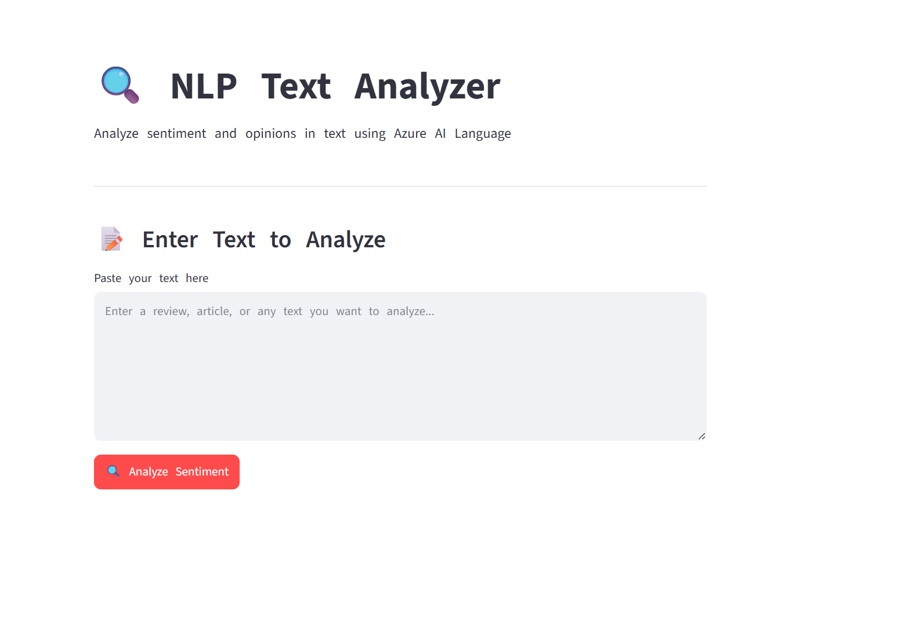
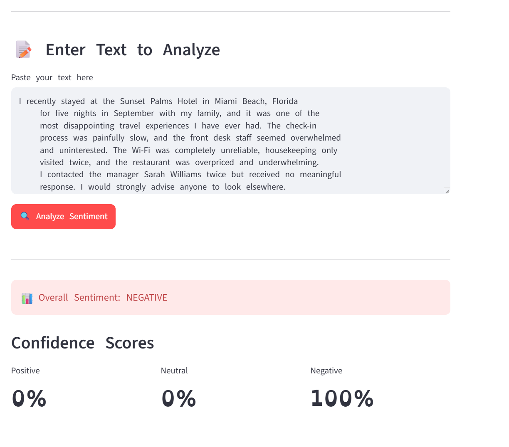
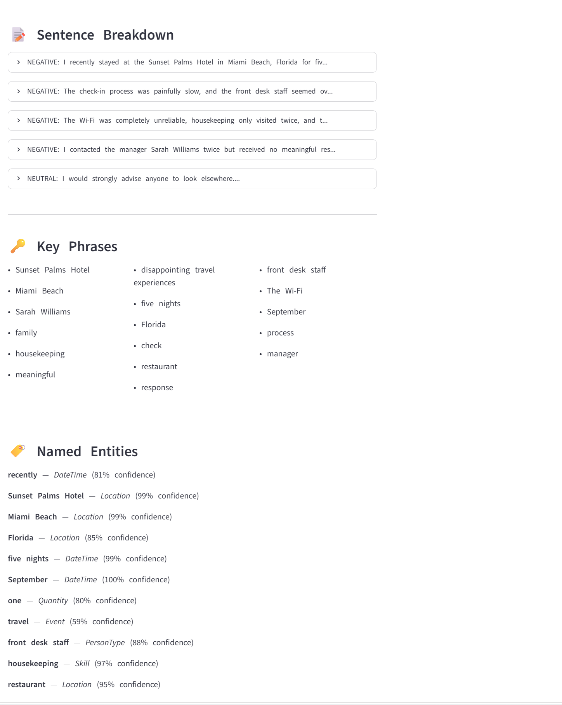

# 🔍 NLP Text Analyzer

A text analytics web application built with Python, Streamlit, and Azure AI Language service.

## Features
- 📊 Sentiment Analysis with confidence scores
- 🔑 Key Phrase Extraction
- 🏷️ Named Entity Recognition
- 📋 Text Summarization
- 📈 Term Frequency Analysis
- 💡 Opinion Mining

## Tech Stack
- Python
- Streamlit
- Azure AI Language
- Azure Cognitive Services

## Setup
1. Clone the repo
2. Install dependencies:
pip install streamlit azure-ai-textanalytics python-dotenv
3. Create .env file:
LANGUAGE_KEY=your_key_here
LANGUAGE_ENDPOINT=your_endpoint_here
4. Run: streamlit run nlp_language_streamlit.py

## Part of AI-900 Portfolio
Built as part of Microsoft Azure AI Fundamentals study portfolio.

## Screenshots

**App Landing Page**

**Sentiment Analysis Results**

**Key Phrases & Named Entities**

**Summary & Term Frequency**

